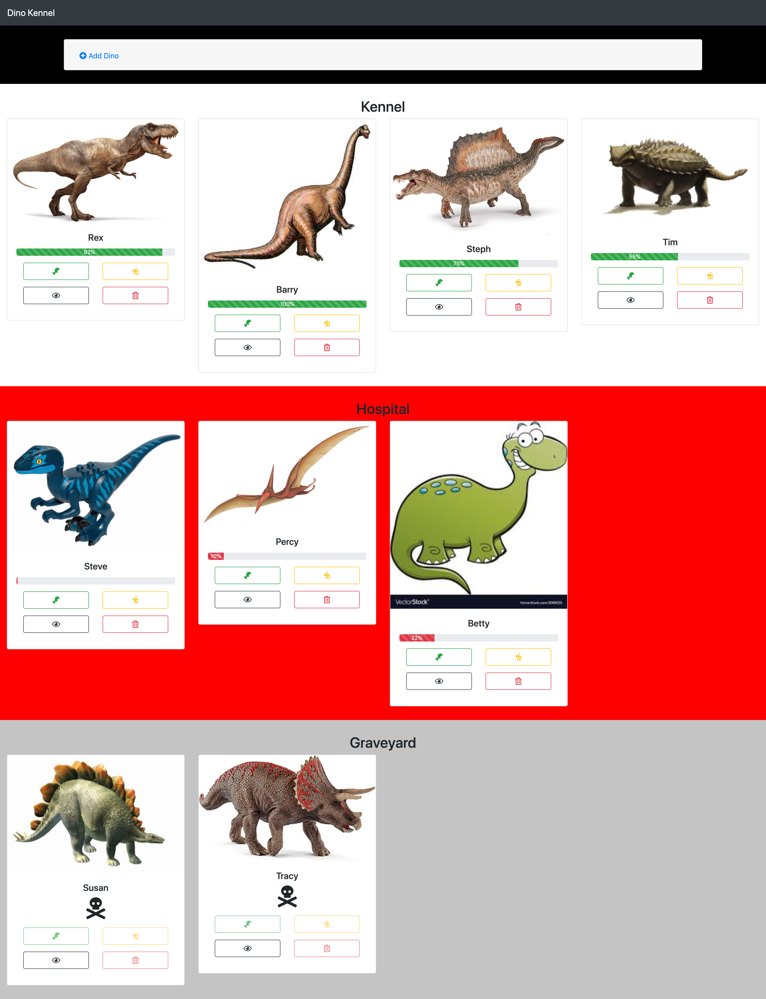
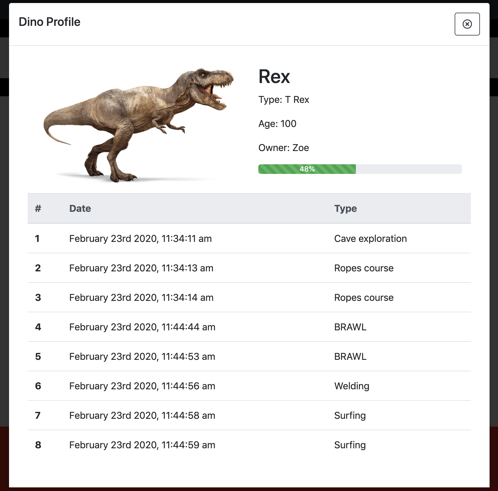
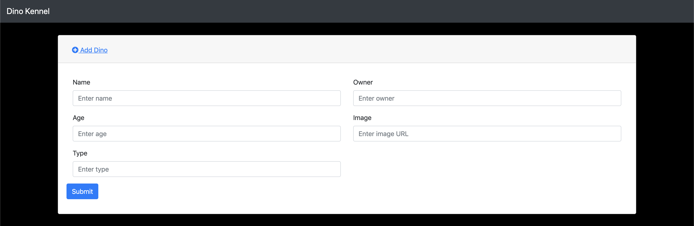

# Dino Kennel

## Description
This project showcases all the vanilla javascript we learned in the foundations milestones.  It is designed to be a record keeping application for a dinosaur kennel.

### Feature List
- Healthy dinos show in the kennel
- Sick dinos show in the hospital
- Dead dinos show in the graveyard
- Dinos can be removed from the kennel
- Dinos can be added to the kennel
- Dinos can be fed
- Dinos can be petted
- Dinos can be sent on an adventure

## Screenshots
### Full Page view

### Single Dino Modal

### Add New Dino

## How to Run
1. Clone down this repo
1. Make sure you have http-server installed via npm. If not get it [HERE](https://www.npmjs.com/package/http-server).
1. On your command line run `hs -p 9999`
1. In your browser go to `http://localhost:9999`

## Contributors
[Zoe Ames](https://github.com/zoeames)

## PRs Since Class
* [Hospital](https://github.com/nss-evening-cohort-11/dino-kennel/pull/26/files)
* [Graveyard](https://github.com/nss-evening-cohort-11/dino-kennel/pull/27/files)
* [Healthy Kennel](https://github.com/nss-evening-cohort-11/dino-kennel/pull/28/files)
* [Adventures](https://github.com/nss-evening-cohort-11/dino-kennel/pull/31/files)
* [DomString Refactor](https://github.com/nss-evening-cohort-11/dino-kennel/pull/32/files)
* [Styling Cleanup](https://github.com/nss-evening-cohort-11/dino-kennel/pull/33/files)
* [README](https://github.com/nss-evening-cohort-11/dino-kennel/pull/34/files)
