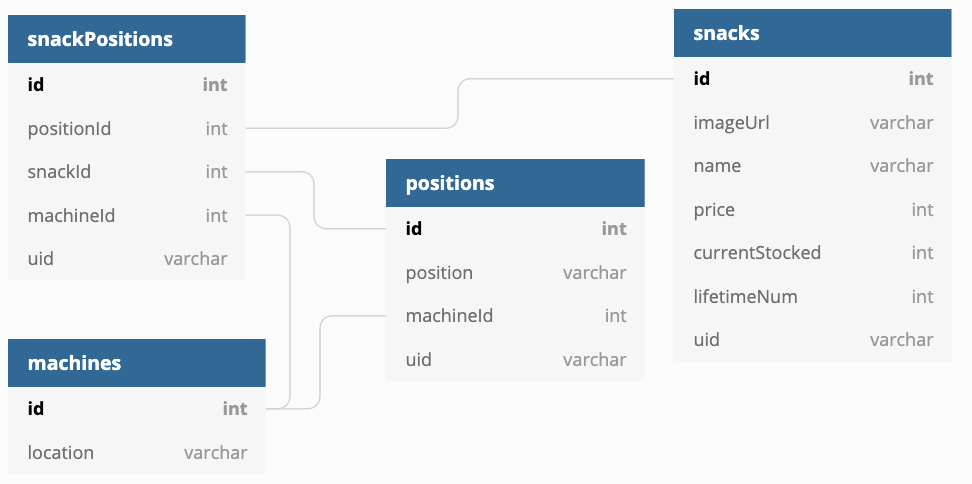

# Week 12 - Day 3

> **Agenda:** Firebase READ

## Create JSON Data
Collections:
* Snacks - CRU
* Positions -R
* Machines - R
* SnackPositions - CRD

## Create the machine
* This is a HUGE smash function that returns positions with snack info in it

## Create the stock snacks
* This is the same smash function from last time but returns snacks with position info in it